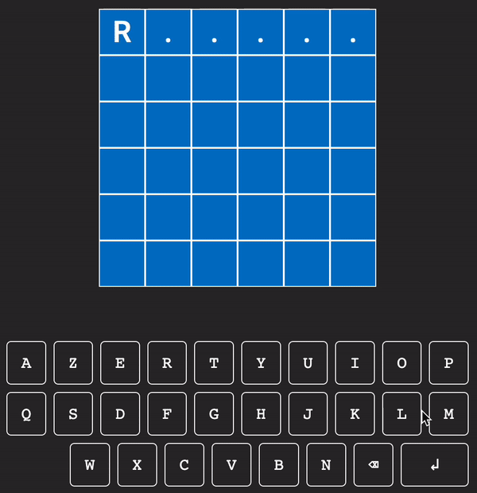

# sutom_cracking
SUTOM (https://sutom.nocle.fr) est un jeu en ligne, dont les règles sont celles du jeu télévisé MOTUS.

Tous les jours, essayez de retrouver le mot secret à partir de sa longueur et de sa première lettre, en au plus 6 coups !

Et, pour plus de défi, tentez de faire mieux que mon bot : vous retrouverez ses performances journalières sur le compte Twitter idoine, à l'adresse https://twitter.com/SutomBot  

## Essayez-vous même
`git clone https://github.com/Charlesarnault/sutom-cracking.git`

`cd sutom_cracking`

`python main.py`
